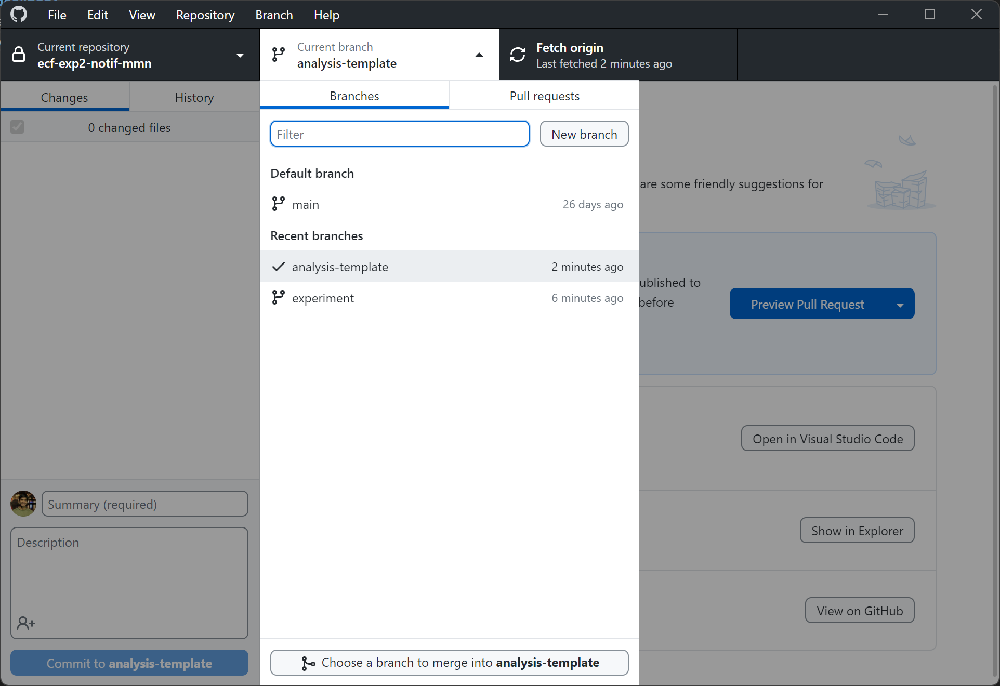

Use this branch as a starting point to create your own private analysis branch. This branch does not have docs and references folders. You can update those directly on the Github website.

In this branch you can create all the mess of notebooks and scripts you need. Once things are finalized and clean, they can be added to the main branch.

You can use some sample data from the full experimental dataset in this branch for your work. No need to include the qhole dataset in this branch.

## To create your own analysis branch:
### In github desktop:
1. Open the analysis-template branch
2. Create a new branch and give it your name

3. Start working in your own branch!

### With command line
1. Switch to the analysis-template branch: `git checkout analysis-template`
2. Create a new branch based on this branch: `git checkout -b <your_name>`
3. Start working in your own branch!